# ⚡ CausalIQ — Autonomous AI Agentic RCA Engine

> **The first "Self-Healing" observability platform that doesn't just show you what's broken — it reasons _why_, verifies _how_, and fixes _it_.**

[](LICENSE)
[](docker-compose.yml)
[](https://python.org)
[](https://fastapi.tiangolo.com)
[-purple.svg)](https://ollama.com)
[](ai_engine/remediation)

---

### 🌟 Executive Highlights

*   **Autonomous Root Cause Analysis:** AI engine that isolates the "Patient Zero" from thousands of cascading alerts.
*   **Noise Elimination:** Cuts through telemetry noise to distinguish between symptoms and upstream failures.
*   **High-Fidelity Diagnosis:** Achieves **>90% confidence** using probabilistic Bayesian causal reasoning.
*   **Historical Intelligence:** Learns from past incidents to prevent repeats and recommend proven remediations.
*   **Closed-Loop Healing:** Supports fully autonomous remediation for automated incident resolution.
*   **MTTR Revolution:** Reduces Mean Time to Resolution (MTTR) from **60+ minutes to ~45 seconds**.

---

## 📋 Table of Contents

- [Problem Statement](#-problem-statement)
- [Solution Overview](#-solution-overview)
- [Architecture](#-architecture)
- [Intelligence Engine](#-intelligence-engine-the-three-pillars)
- [Autonomous Remediation](#-closed-loop-autonomous-remediation)
- [Performance Optimization](#-intelligent-throttling--caching)
- [Technology Stack](#-technology-stack)
- [Services](#-services)
- [Prerequisites](#-prerequisites)
- [Quick Start](#-quick-start)
- [Demo — Full Incident Simulation](#-demo--full-incident-simulation)
- [API Reference](#-api-reference)
- [Configuration](#-configuration)
- [Operational Docs](#-operational-docs)
- [Project Structure](#-project-structure)
- [Troubleshooting](#-troubleshooting)
- [Teardown](#-teardown)

---

## 🔥 Problem Statement

In modern microservice environments, a single database glitch can trigger hundreds of downstream alerts. SRE teams suffer from **Alert Fatigue** — spending hours manually tracing dependencies to find "Patient Zero."

| Pain Point           | Impact                                               |
| -------------------- | ---------------------------------------------------- |
| **Downtime Cost**    | $5,600 per minute on average (Gartner)               |
| **Manual Triage**    | 60–90 minutes per major incident                     |
| **Alert Noise**      | Thousands of symptomatic alerts masking 1 root cause |
| **Tribal Knowledge** | Diagnosis depends on a few experienced engineers     |

Traditional dashboards show _something_ is wrong — but not _why_ it's wrong or _how_ to fix it.

---

## 🚀 Solution Overview

**CausalIQ** is an **Autonomous Incident Response** platform that uses a fusion of **Bayesian Networks**, **Service Topology Graphs**, and **Agentic AI** to move from passive monitoring to autonomous healing.

```
Detect → Diagnose → Verify → Remediate
```

- **Diagnostic Precision** — Isolate the exact root cause with >90% statistical confidence
- **Autonomous Reasoning** — A live tool-calling Llama3.1 Agent verifies hypotheses like a senior SRE
- **MTTR Reduction** — Mean Time To Resolution drops from 60 minutes to ~45 seconds
- **Historical Intelligence** — Learns from every past incident via a Vector RAG pipeline

---

## 📐 Architecture

CausalIQ operates as a closed-loop **Detect → Diagnose → Verify → Remediate** engine.

```mermaid
graph TD
    A[Microservices] -->|Telemetry| B(OTel Collector)
    B -->|Logs/Traces/Metrics| C{Redpanda / Kafka}
    C -->|Stream| D[Stream Processor]
    D -->|Features| E[Ensemble Anomaly Detector]
    E -->|Anomaly Events| F{RCA Orchestrator}

    subgraph "AI Reasoning Core"
        F -->|Topology Query| G[Neo4j Graph]
        F -->|Probabilistic RCA| H[Bayesian Engine - pgmpy]
        H -->|Ranked Candidates| I[Agentic LLM - Llama3.1]
        I -->|Tool Call: Raw Logs| J[ClickHouse Query]
        I -->|Tool Call: Graph Path| G
        I -->|Tool Call: Past Incidents| K[Qdrant RAG Memory]
    end

    I -->|Verified RCA Report| L[(ClickHouse - Incident Store)]
    I -->|Healing Action| M[Remediation Runner]
    M -->|Script Execution| A
    L -->|WebSocket Push| N[React Dashboard]

    style H fill:#1a2a1a,stroke:#00e5a0
    style I fill:#1a1a2a,stroke:#a855f7
    style K fill:#2a1a1a,stroke:#f59e0b
```



### End-to-End Workflow

**Phase 1 — Baseline Monitoring**
The SRE opens the CausalIQ Dashboard. ClickHouse ingests metrics continuously. The Causal Graph shows a healthy, pulsing network of services in green.

**Phase 2 — Incident Detection**
A service experiences a latency spike. The Ensemble Detector (Isolation Forest + Sliding Window Correlation) identifies this as an anomaly — ignoring natural busy-hour traffic patterns through online retraining.

**Phase 3 — Bayesian Assessment**
The Bayesian Engine calculates conditional probabilities using learned history. It asks: *"Given that Service A is failing, what is the probability that Service B is the root cause?"* It identifies the true origin of failure with mathematical precision.

#### 1. 🧠 Bayesian Causal Learning
Unlike simple rule-based tools, CausalIQ uses **Bayesian Conditional Probability Tables (CPTs)** to calculate root-cause probabilities. It learns from every historical incident in ClickHouse, mathematically identifying which services are the true origin of failure versus mere symptoms.

#### 2. 🕸️ Graph-Based Topology
The system maps your infrastructure into a **Neo4j Directed Acyclic Graph (DAG)**. When an anomaly occurs, the AI performs "Graph Traversal" to trace the path of destruction across upstream and downstream services.

#### 3. 🤖 Local Agentic AI (Ollama)
CausalIQ leverages **local LLMs (Llama 3 via Ollama)** to act as a "Senior SRE." The agent uses specialized tools to query metrics and logs, then synthesizes a human-readable explanation of the incident without any data ever leaving your network.

---

### 🚀 Closed-Loop Autonomous Remediation

CausalIQ doesn't just stop at detection. It features a fully autonomous "Remediation Executor":

- **High Confidence Mode (>95%):** The AI automatically executes the corrective action (e.g., scaling pods, restarting services) and notifies Slack/Jira.
- **Human-in-the-Loop Mode (<95%):** The AI presents a "Proposed Action" to the SRE in Slack with "Approve" and "Reject" buttons.
- **Fail-Safe Mechanism:** If an autonomous action fails to restore health, the system immediately escalates to a human operator.

### ⚡ Intelligent Throttling & Caching

To prevent "Alert Fatigue" and reduce operational costs:
- **MD5 Result Caching:** Identical failure patterns are cached in-memory. Repeat incidents receive instant diagnosis without re-running heavy AI cycles.
- **Service Cooldowns:** A 120-second cooldown window per service prevents alert storms during cascading failures.

**Phase 4 — Agentic Verification**
The Llama3.1 Agent wakes up and acts like an autonomous investigator:

1. **Tool Call →** Queries ClickHouse for `payment-service` DB connection logs
2. **Finding →** Discovers "Connection Pool Exhausted" error at timestamp
3. **Memory Check →** Queries Qdrant: _"Similar issue in Feb — resolved by increasing max_connections"_

**Phase 5 — Verified Resolution**
The Agent writes a verified report: _"Root Cause: Payment DB Pool Exhaustion at 14:23:01. Confidence: 94%. Recommendation: Scale DB connections to 300."_ Dashboard updates in real time.

**Result:** MTTR reduced from **60 minutes → 45 seconds**. Incident logged for future learning.

---

## 🧬 Intelligence Engine — The Three Pillars

### Pillar 1: Ensemble Anomaly Detection

| Property       | Detail                                                               |
| -------------- | -------------------------------------------------------------------- |
| **Algorithm**  | Isolation Forest (scikit-learn) + Sliding Window Correlation         |
| **Features**   | `avg_latency`, `p99_latency`, `error_rate`, `throughput` per service |
| **Retraining** | Online retraining every 5 minutes — adapts to natural traffic shifts |
| **Goal**       | Rapid, seasonality-aware detection with minimal false positives      |

### Pillar 2: Bayesian Causal Inference

| Property    | Detail                                                               |
| ----------- | -------------------------------------------------------------------- |
| **Library** | `pgmpy` — Probabilistic Graphical Models                             |
| **Model**   | Structural Causal Model built from live Neo4j service topology       |
| **Logic**   | Computes _P(Service A = Root Cause \| Services B, C show anomalies)_ |
| **Priors**  | Uniform on fresh install → updated from resolved incident history    |
| **Goal**    | Eliminate false positives from downstream symptoms                   |

> **How priors improve over time:** On fresh install, the Bayesian engine uses uniform priors (equal probability across all nodes). After 10+ resolved incidents, priors are updated from ClickHouse incident history — the system becomes measurably more accurate week-over-week.

### Pillar 3: Agentic Verification (ReAct Pattern)

| Property      | Detail                                                                                 |
| ------------- | -------------------------------------------------------------------------------------- |
| **Framework** | LangChain (ReAct Agent Pattern)                                                        |
| **LLM**       | Llama 3.1 via Ollama (self-hosted, data never leaves your infrastructure)              |
| **Tools**     | ClickHouse query, Neo4j graph traversal, Qdrant semantic search                        |
| **Embedding** | `nomic-embed-text` (dedicated embedding model — no compute competition with inference) |
| **Goal**      | Deep-dive verification + human-readable incident narration grounded in live evidence   |

---

## 🛠️ Technology Stack

| Layer                    | Technology                    | Why This Choice                                                         |
| ------------------------ | ----------------------------- | ----------------------------------------------------------------------- |
| **Streaming**            | Redpanda (Kafka-compatible)   | Sub-millisecond latency, no ZooKeeper, Kafka-compatible API             |
| **Metrics/Logs Storage** | ClickHouse (OLAP)             | Sub-second queries over billions of rows; columnar compression          |
| **Graph Database**       | Neo4j                         | Native graph traversal for service topology and causal path queries     |
| **Causal Inference**     | pgmpy (Bayesian Networks)     | Probabilistic certainty scores; handles non-linear failure topologies   |
| **Anomaly Detection**    | scikit-learn Isolation Forest | Unsupervised, handles multivariate signals, online retraining support   |
| **LLM Reasoning**        | LangChain + Llama3.1 (Ollama) | ReAct agent with tool-calling; fully local inference; no vendor lock-in |
| **Vector Memory**        | Qdrant                        | Metadata-rich historical incident search; Rust-native performance       |
| **Embeddings**           | nomic-embed-text              | Dedicated embedding model; does not compete with LLM inference GPU      |
| **Telemetry**            | OpenTelemetry Collector       | CNCF standard; auto-instruments traces, metrics, and logs               |
| **Caching**              | Redis                         | Hot alert state, API response caching, deduplication                    |
| **Tracing**              | Jaeger                        | Distributed trace storage and visualization                             |
| **Metrics Scraping**     | Prometheus + Grafana          | Self-monitoring CausalIQ's own health                                   |
| **Backend API**          | FastAPI + Uvicorn             | Async REST + WebSocket; auto-generates OpenAPI docs                     |
| **Frontend**             | React + TailwindCSS + Zustand | Real-time WebSocket dashboard; Cytoscape.js causal graph                |
| **Load Testing**         | Locust                        | Realistic ramp-up patterns with fault orchestration                     |

---

## 📚 Operational Docs

- Problem Statement Alignment: [docs/PROBLEM_STATEMENT_ALIGNMENT.md](docs/PROBLEM_STATEMENT_ALIGNMENT.md)
- Operational Architecture Flow: [docs/ARCHITECTURE_CAUSAL_FLOW.md](docs/ARCHITECTURE_CAUSAL_FLOW.md)
- Incident Runbooks: [docs/RUNBOOKS.md](docs/RUNBOOKS.md)

These documents define how to validate RCA quality, run repeatable incident response, and demonstrate alignment with the root-cause-analysis problem statement.

---

## 📦 Services

| Service            | Port        | Description                                                                   |
| ------------------ | ----------- | ----------------------------------------------------------------------------- |
| `auth-service`     | 8000        | JWT authentication microservice (OTel instrumented)                           |
| `order-service`    | 8001        | Order management microservice                                                 |
| `payment-service`  | 8002        | Payment processor with built-in fault injection endpoint                      |
| `otel-collector`   | 4317 / 4318 | OpenTelemetry Collector (traces → Jaeger, metrics → Prometheus, logs → Kafka) |
| `redpanda`         | 19092       | Kafka-compatible streaming broker                                             |
| `redpanda-console` | 8080        | Redpanda Web UI                                                               |
| `neo4j`            | 7474 / 7687 | Causal graph database (Browser + Bolt)                                        |
| `clickhouse`       | 8123        | Columnar log/metrics OLAP store                                               |
| `qdrant`           | 6333        | Vector DB for RAG incident memory                                             |
| `redis`            | 6379        | API response cache and alert deduplication                                    |
| `prometheus`       | 9090        | Metrics collection and scraping                                               |
| `grafana`          | 3001        | Metrics visualization (admin / causaliq123)                                   |
| `jaeger`           | 16686       | Distributed trace viewer                                                      |
| `ollama`           | 11434       | Local LLM server (Llama3.1 + nomic-embed-text)                                |
| `backend`          | 9001        | FastAPI REST API + WebSocket bridge                                           |
| `frontend`         | 3000        | React dashboard                                                               |
| `stream-processor` | —           | Kafka consumer and sliding-window feature extractor                           |
| `anomaly-detector` | —           | Isolation Forest ML anomaly scoring (retrains every 5 min)                    |
| `rca-engine`       | —           | Full RCA orchestration: Bayesian → Agent → Remediation                        |

---

## ✅ Prerequisites

| Requirement             | Minimum   | Recommended                |
| ----------------------- | --------- | -------------------------- |
| Docker Desktop          | v24+      | Latest                     |
| RAM allocated to Docker | **16 GB** | 32 GB                      |
| CPU cores               | 4         | 8+                         |
| Disk space              | 20 GB     | 40 GB                      |
| Internet (first boot)   | Required  | Required                   |
| NVIDIA GPU              | Optional  | Recommended for faster LLM |

> **Why 16 GB?** Llama3.1 requires ~8 GB RAM alone. ClickHouse, Neo4j, Redpanda, and Qdrant each need 1–2 GB. Running below 16 GB will cause OOM crashes.

### Low-RAM Alternative

If your machine has less than 16 GB available for Docker, swap to a smaller model:

```yaml
# In docker-compose.yml → rca-engine service
environment:
  LLM_MODEL: llama3.2:1b # ~1.5 GB instead of ~8 GB
```

---

## 🚀 Quick Start

### Step 1 — Pre-pull LLM Models (Do This First)

Ollama pulls Llama3.1 and nomic-embed-text on first boot — approximately 8 GB download. Do this before your demo, not during it.

```bash
# Start only Ollama first
docker-compose up -d ollama

# Wait 30 seconds, then pre-pull both models
docker exec causaliq-ollama-1 ollama pull llama3
docker exec causaliq-ollama-1 ollama pull nomic-embed-text

# Confirm models are ready
docker exec causaliq-ollama-1 ollama list
```

### Step 2 — Clone and Start

```bash
git clone <repo-url>
cd causaliq

# Build and start all services
docker-compose up --build -d

# Monitor startup logs
docker-compose logs -f
```

### Step 3 — Wait for Readiness (~3–5 minutes)

Services start in dependency order. Check all services are healthy:

```bash
docker-compose ps
```

All services should show `healthy` or `running`. If any service shows `unhealthy`, see [Troubleshooting](#-troubleshooting).

### Step 4 — Open the Dashboard

| Interface              | URL                            | Credentials         |
| ---------------------- | ------------------------------ | ------------------- |
| **CausalIQ Dashboard** | http://localhost:3000          | —                   |
| Backend API Docs       | http://localhost:9001/api/docs | —                   |
| Redpanda Console       | http://localhost:8080          | —                   |
| Jaeger Traces          | http://localhost:16686         | —                   |
| Prometheus             | http://localhost:9090          | —                   |
| Grafana                | http://localhost:3001          | admin / causaliq123 |
| Neo4j Browser          | http://localhost:7474          | neo4j / causaliq123 |

---

## 🎯 Demo — Full Incident Simulation

### Option A — Via Dashboard (Recommended for Live Demo)

1. Open http://localhost:3000
2. Navigate to **Dashboard**
3. In the **Incident Simulation** panel, configure:
   - Duration: `120s`
   - Concurrency: `20`
   - Fault DB Latency: `500ms`
   - ✅ Enable: **Inject DB Fault**
4. Click **Launch Incident Simulation**
5. Watch the platform respond in real time:
   - Latency charts spike on `payment-service`
   - Anomaly table populates with scored events
   - Causal graph rebuilds with red failure nodes
   - RCA incident appears with Bayesian confidence score
   - Llama3.1 Agent generates verified natural-language explanation

### Option B — Via Load Generator Container

```bash
docker-compose --profile simulation up load-generator
```

### Option C — Manual REST API

```bash
# Trigger load test with fault injection
curl -X POST http://localhost:9001/trigger-load \
  -H 'Content-Type: application/json' \
  -d '{
    "duration_seconds": 120,
    "concurrency": 20,
    "inject_fault": true,
    "fault_db_latency_ms": 800
  }'
```

---

## 🔌 API Reference

### `GET /incidents`

Returns all detected incidents with root cause, Bayesian confidence score, and impact chain.

### `GET /rca/{incident_id}`

Full RCA detail for a specific incident:

- Root cause service and timestamp
- Confidence score (0.0 – 1.0)
- Impact chain (ordered list of affected services)
- Ranked root cause candidates with individual scores
- Bayesian causal inference result
- LLM-generated natural-language explanation
- Similar historical incidents from Qdrant

### `GET /graph`

Current service dependency graph as nodes and edges from Neo4j.

### `GET /metrics`

Per-service telemetry snapshot: `avg_latency`, `p99_latency`, `error_rate`, `throughput`.

### `GET /anomalies`

Recent anomaly events with Isolation Forest anomaly scores and detection timestamps.

### `POST /trigger-load`

Programmatically trigger a load test with optional fault injection.

```json
{
  "duration_seconds": 120,
  "concurrency": 20,
  "inject_fault": true,
  "fault_db_latency_ms": 800
}
```

### `WebSocket /ws/live`

Real-time stream of RCA results and anomaly events pushed directly from Kafka topics. Connect once — receive all incident updates as they happen.

---

## 🔧 Configuration

All services are configured via environment variables in `docker-compose.yml`.

### Key Variables

| Variable                  | Default            | Description                                                                     |
| ------------------------- | ------------------ | ------------------------------------------------------------------------------- |
| `ANOMALY_SCORE_THRESHOLD` | `-0.3`             | Isolation Forest threshold. More negative = more selective. Range: -1 to 0.     |
| `MIN_TRAINING_SAMPLES`    | `100`              | Minimum samples before first model inference. Lower = faster but less accurate. |
| `WINDOW_SECONDS`          | `60`               | Sliding window size for correlation detection.                                  |
| `LLM_MODEL`               | `llama3`           | Ollama model name. Change to `mistral` or `llama3.2:1b` for lower RAM.          |
| `EMBED_MODEL`             | `nomic-embed-text` | Embedding model for Qdrant incident vectorization.                              |
| `BAYESIAN_MIN_CONFIDENCE` | `0.7`              | Minimum confidence to trigger Agentic verification phase.                       |
| `RAG_TOP_K`               | `3`                | Number of similar past incidents retrieved from Qdrant per query.               |

### Switch to Mistral

```yaml
# docker-compose.yml → rca-engine service
environment:
  LLM_MODEL: mistral
```

Also update the Ollama entrypoint to pull `mistral` instead of `llama3`.

### Use Slim Profile (Lower RAM)

To run only core services without Grafana, Jaeger, and Prometheus monitoring:

```bash
docker-compose --profile slim up -d
```

---

## 📁 Project Structure

```
causaliq/
├── services/
│   ├── auth-service/            # FastAPI + JWT + OTel instrumentation
│   ├── order-service/           # FastAPI + cross-service HTTP calls
│   └── payment-service/         # FastAPI + fault injection endpoint
│
├── otel/
│   ├── config.yaml              # OTel Collector: traces→Jaeger, metrics→Prometheus, logs→Kafka
│   ├── prometheus.yml           # Prometheus scrape targets
│   └── grafana-datasources.yml  # Auto-provisioned Grafana data sources
│
├── streaming/
│   ├── kafka_setup.py           # Topic provisioner (runs on startup)
│   └── Dockerfile.setup
│
├── processing/
│   └── stream_processor.py      # Sliding-window correlation engine (Kafka consumer)
│
├── ai_engine/
│   ├── anomaly/
│   │   └── detector.py          # Isolation Forest with online retraining every 5 min
│   ├── causal/
│   │   └── graph_engine.py      # Neo4j topology + pgmpy Bayesian inference
│   ├── llm/
│   │   └── explainer.py         # Ollama LLM + LangChain ReAct Agent + Qdrant RAG
│   └── orchestrator.py          # Full RCA pipeline coordinator
│
├── backend/
│   └── app/
│       └── main.py              # FastAPI REST + WebSocket + Kafka bridge
│
├── frontend/
│   └── src/
│       ├── App.js               # App shell and routing
│       ├── store/
│       │   └── useStore.js      # Zustand state management + WebSocket + API calls
│       └── pages/
│           ├── Dashboard.js         # Live overview + incident simulation panel
│           ├── IncidentAnalysis.js  # Timeline + RCA detail modal
│           ├── CausalGraph.js       # Cytoscape.js interactive graph viewer
│           └── MetricsPage.js       # Recharts metric charts + anomaly score table
│
├── load_generator/
│   └── locustfile.py            # Locust load test + fault orchestration
│
├── scripts/
│   └── preload_models.sh        # Pre-pull LLM models before demo
│
└── docker-compose.yml           # All 17+ services with health checks and profiles
```

---

## 🛑 Troubleshooting

### Ollama is slow to respond or times out

LLM inference on CPU is slow. First inference after startup takes 30–60 seconds as the model loads into memory. Subsequent calls are faster. If you have an NVIDIA GPU, ensure Docker has GPU access enabled.

```bash
# Check if GPU is accessible
docker exec causaliq-ollama-1 nvidia-smi
```

### A service shows "unhealthy"

```bash
# Check logs for the specific service
docker-compose logs <service-name> --tail=50

# Restart a single service
docker-compose restart <service-name>
```

### Neo4j fails to start

Neo4j requires at least 2 GB RAM. Check Docker Desktop memory allocation and increase it if needed.

### Anomaly detector not triggering during simulation

The Isolation Forest needs `MIN_TRAINING_SAMPLES` (default: 100) data points before it can detect anomalies. Wait 2–3 minutes after startup for baseline metrics to accumulate, then trigger the simulation.

### ClickHouse connection refused

ClickHouse takes 60–90 seconds to fully initialize on first boot. If the backend reports connection errors, wait and retry.

```bash
# Verify ClickHouse is ready
curl http://localhost:8123/ping
# Expected response: Ok.
```

### Out of memory during startup

Reduce RAM usage by switching to a smaller LLM model:

```yaml
# docker-compose.yml
environment:
  LLM_MODEL: llama3.2:1b
```

Then re-pull:

```bash
docker exec causaliq-ollama-1 ollama pull llama3.2:1b
```

---

## 🧹 Teardown

```bash
# Stop all services (preserves data volumes)
docker-compose down

# Stop and remove all volumes — full reset to clean state
docker-compose down -v

# Remove all built images as well
docker-compose down -v --rmi all
```

---

## 🗺️ Roadmap

- [ ] Slack / PagerDuty webhook integration for incident notifications
- [ ] Remediation approval gate UI (human-in-the-loop before script execution)
- [ ] Kubernetes Helm chart for production deployment
- [ ] Incident export to PDF and Jira
- [ ] Model retraining dashboard with sample count and accuracy metrics
- [ ] Multi-tenant support with role-based access control
- [ ] Feedback loop: resolved incident outcomes update Bayesian priors automatically

---

## 📜 License

MIT — Built for production by the CausalIQ team.
